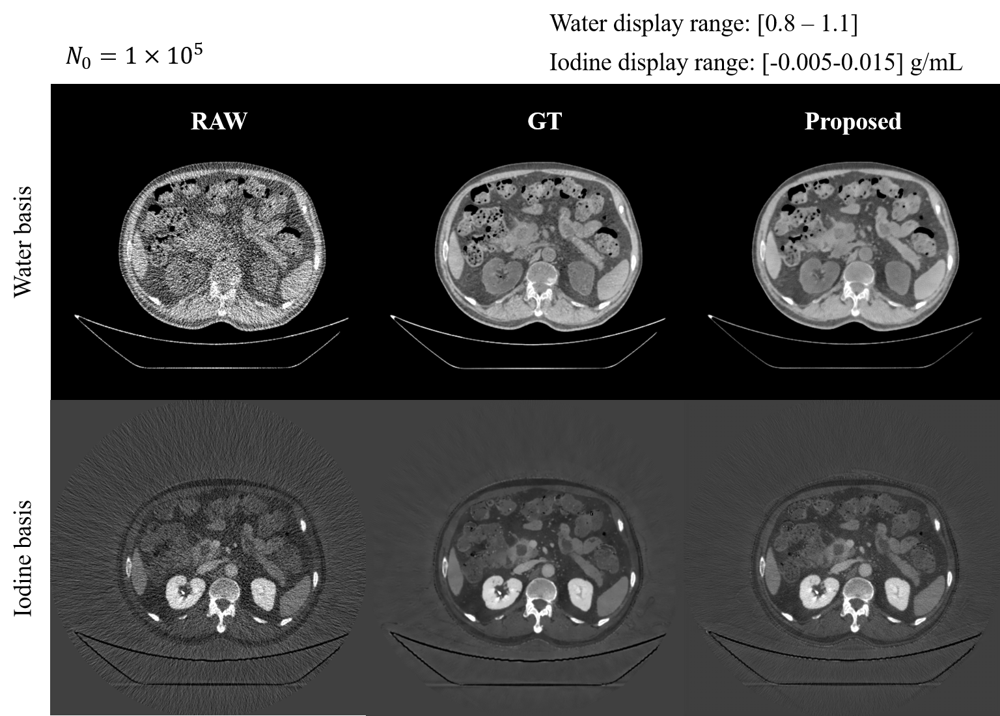

# Ne2Ne-IMG: Use Neighbour2Neighbour to denoise material decomposition noise in image domain

## Whats new?

This is a method for denoising material decomposition noise in dual energy CT, and its advantages include:

- [x] No need of labels
- [x] Based on [torch-mando](https://github.com/SEU-CT-Recon/torch-mando) to generate noise online, introduce data enhancement, and provide custom reconstruction parameters
- [x] Physical endorsement of image domain material decomposition

This method use Neighbour2Neighbour variant method, named [FIRE](https://link.springer.com/chapter/10.1007/978-3-031-43990-2_44) to improve denoise performance.

## Outcome

The CT image is decomposed into water and iodine basis, and $N_0$ means the number of incident photons in projection domain per detector pixel.
